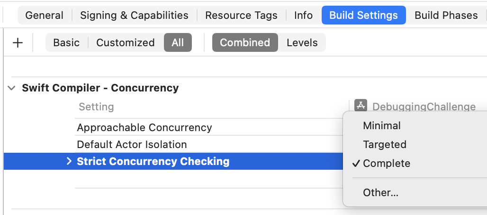

# Preparing for Swift 6 Concurrency: Fix Issues Early

Swift 6 enforces stricter concurrency rules, turning patterns that were previously allowed or warned about in Swift 5 into compile-time errors. This includes non-`Sendable` types crossing concurrency boundaries, mutable captured state in concurrent closures, and actor-isolation violations. Without preparation, migrating to Swift 6 can produce a large number of errors and slow down your release cycle.

Xcode provides a way to surface most of these issues in Swift 5 using the **Strict Concurrency Checking** (`SWIFT_STRICT_CONCURRENCY`) setting. It has three modes: **Minimal**, **Targeted**, and **Complete**. Minimal checks only explicit `@Sendable` closures and marked types, while Targeted surfaces many warnings about potential Swift 6 issues. **Complete mode is the key**: it shows nearly all concurrency problems that Swift 6 would treat as errors, allowing you to fix them incrementally while keeping your project compiling in Swift 5. 

The practical approach is simple: start with Targeted mode to address obvious issues, then enable Complete mode to uncover the full set of Swift 6 errors. Fixing these incrementally — wrapping mutable state in actors, marking types as `Sendable`, and respecting actor isolation — ensures a smooth migration. By resolving these issues early, you can adopt Swift 6 without a large refactoring spike and maintain a stable codebase during the transition.

